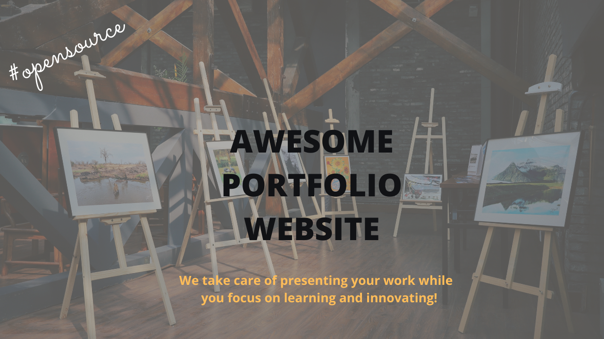
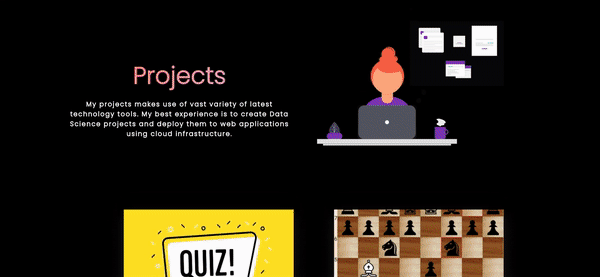
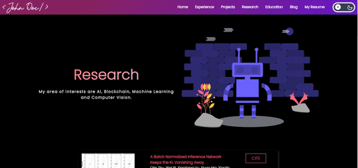

A personal portfolio which is simple, fast and less cumbersome. A full-fledged website to showcase work.

## A sneak peek into :

### Home Page:

### Experience Page:

### Project Page:

### Research Page:

### Education Page:

## Project Maintainers:

|  |  | 
| :----------------------------------------------------------: | :----------------------------------------------------------: | 
|     [Apple Pear](https://github.com/applepear19) |    [MHSMTG](https://github.com/mhsmtg)
